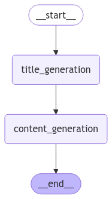
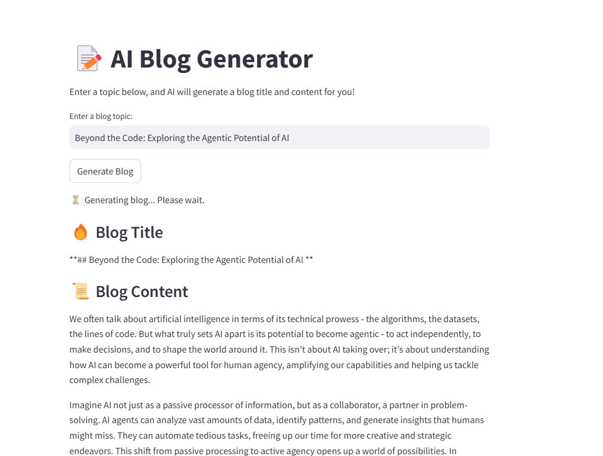

# AI Blog Generator

## Overview
The **AI Blog Generator** is a Streamlit web application that leverages Groq's AI models to generate blog titles and content based on user-provided topics. The application utilizes **LangGraph** for structured workflow execution and **LangChain** for AI-powered text generation.

## Features
- Accepts user input for blog topics.
- Generates a compelling blog title.
- Produces a structured blog post (500-word limit, 4 paragraphs).
- Displays results dynamically in a Streamlit UI.

## Tech Stack
- **Python**
- **Streamlit** (for UI)
- **LangChain & LangGraph** (for AI workflows)
- **Groq API** (for AI model interaction)
- **Dotenv** (for managing environment variables)

## Installation

1. Clone this repository:
   ```bash
   git clone https://github.com/your-repo/ai-blog-generator.git
   cd ai-blog-generator
   ```
2. Create a virtual environment and activate it:
   ```bash
   python -m venv venv
   source venv/bin/activate  # On Windows use: venv\Scripts\activate
   ```
3. Install dependencies:
   ```bash
   pip install -r requirements.txt
   ```
4. Set up your environment variables:
   - Create a `.env` file in the project root.
   - Add your **Groq API Key**:
     ```
     GROQ_API_KEY=your_api_key_here
     ```

## Usage

Run the application using the following command:
```bash
streamlit run app.py
```

## Workflow Diagram


## Application UI Preview


## Code Structure
```
├── app.py                # Main application file
├── requirements.txt      # Dependencies
├── .env                  # Environment variables (not committed)
├── README.md             # Documentation
```

## How It Works
1. User enters a blog topic in the input field.
2. Clicking "Generate Blog" triggers the AI workflow.
3. **Title Generation:**
   - AI generates a blog title.
4. **Content Generation:**
   - AI creates a 500-word blog post.
5. Results are displayed dynamically in the UI.

## Future Enhancements
- Add multiple blog formats (e.g., Listicle, How-To Guides, Technical Articles).
- Support for different writing tones (e.g., Formal, Casual, Professional).
- Integration with Markdown export.

## License
This project is licensed under the MIT License.


