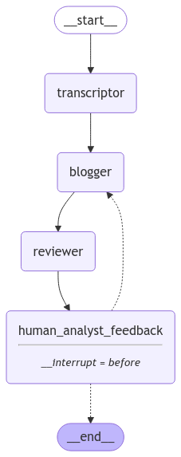
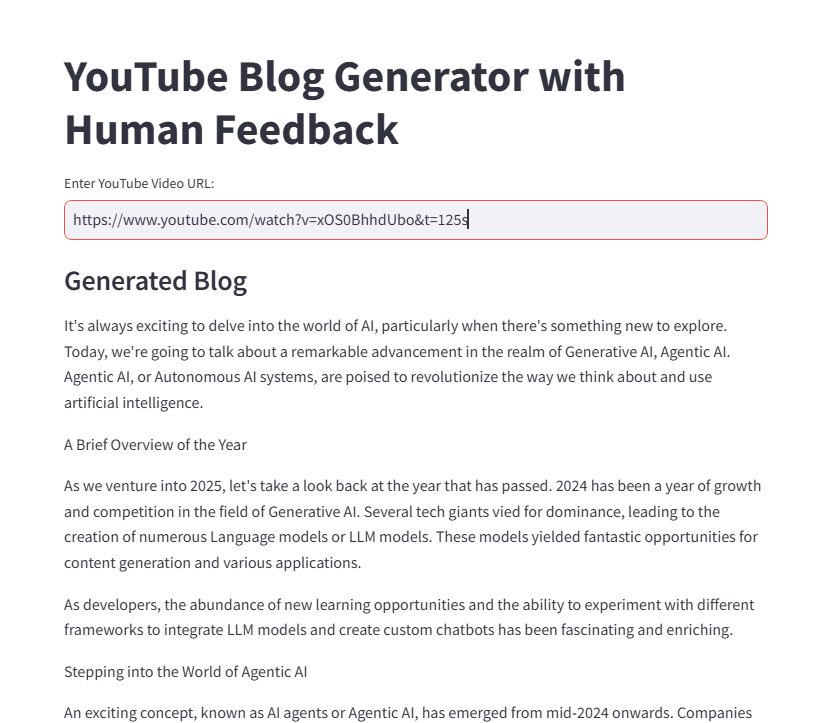

# YouTube Blog Generator with Human Feedback

## Overview
This Streamlit application allows users to generate blog posts from YouTube video transcripts using AI models. The app retrieves the video transcript, generates a blog post, collects human feedback, and refines the blog based on the feedback. It leverages OpenAI's ChatGPT or Groq's Llama models for text generation and LangGraph for workflow execution.

## Features
- Extracts video transcripts from YouTube.
- Generates blog posts using AI.
- Provides an AI-generated review of the blog.
- Accepts human feedback to refine the blog.
- Interactive workflow using LangGraph.
- Streamlit-based user interface.

## Installation
### Prerequisites
- Python 3.8+
- Pip
- API keys for OpenAI and Groq (if using Groq models)

### Steps
1. Clone the repository:
   ```bash
   git clone <repo-url>
   cd <repo-folder>
   ```
2. Install dependencies:
   ```bash
   pip install -r requirements.txt
   ```
3. Create a `.env` file and add the API keys:
   ```plaintext
   OPENAI_API_KEY=your_openai_api_key
   GROQ_API_KEY=your_groq_api_key (if using Groq)
   ```
4. Run the application:
   ```bash
   streamlit run app.py
   ```

## Usage
1. Enter the YouTube video URL.
2. The app fetches the transcript and generates an initial blog post.
3. An AI-generated review of the blog is displayed.
4. Users can provide feedback to refine the blog.
5. The final blog post is displayed based on feedback.

## Workflow Diagram


## App UI


## Dependencies
- `streamlit`
- `youtube_transcript_api`
- `langchain_openai`
- `langchain_groq`
- `langgraph`
- `python-dotenv`

## Future Enhancements
- Support for additional AI models.
- Enhanced text formatting and styling.
- Multi-language transcript and blog support.

## License
MIT License

## Author
Manish Shrivastava

